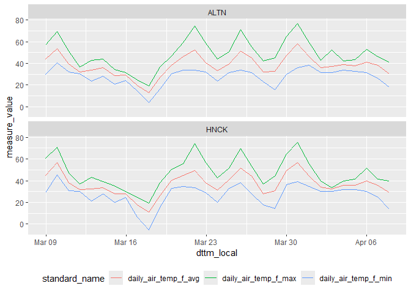

# Wisconet v1 API wrapper for R

`rwisconet` provides an interface to the Wisconet v1 API
(<https://wisconet.wisc.edu/api/v1>). Supports fetching station
metadata, available field definitions, and observation data for one or
more stations.

## Installation

``` r
remotes::install_github("bzbradford/rwisconet")
```

## Basic Usage

### Initialize the client

Creating a new client automatically fetches station and field metadata
from the API. Default timezone is “America/Chicago” for interpreting
date/time ranges and the conversion of UTC to local time.

``` r
suppressPackageStartupMessages(library(tidyverse))
library(rwisconet)

# initialize the connection
wn <- Wisconet$new()
```

You can skip the initial metadata fetch or use a different timezone, but
normally you would leave the default settings.

``` r
wn <- Wisconet$new(timezone = "US/Eastern", fetch_on_init = FALSE)
```

### Configuration

Several configutation options are available in the `wn$config` object.
For example, the timezone is stored in `wn$config$timezone`. There are
several other configuration options you can set that affect the
throttling, concurrency, or retry behavior of API calls to Wisconet.
Each can be set like `wn$config${config_name} <- {config_value}`, but
default values should work fine. See all config options and values by
executing `wn` or `wn$print()`:

``` r
wn
#> <Wisconet API>
#>   Stations: 78 
#>   Fields: 253 
#>   Config:
#>     timezone: America/Chicago
#>     capacity: 20
#>     fill_time_s: 20
#>     max_tries: 5
#>     max_concurrent: 10
```

### Explore stations

The station metadata table is stored in `wn$stations`. You can refresh
it at any time with `wn$get_stations()`.

``` r
# extract the stations table
stns <- wn$stations

# view it
glimpse(stns)
#> Rows: 78
#> Columns: 15
#> $ station_id        <chr> "ANGO", "ALTN", "RTHR", "BBCK", "BYFD", "BLCR", "WCR…
#> $ station_slug      <chr> "antigo", "arlington", "arthur", "babcock", "bayfiel…
#> $ station_name      <chr> "Antigo", "Arlington", "Arthur", "Babcock", "Bayfiel…
#> $ latitude          <dbl> 45.15890, 43.29660, 45.03200, 44.25380, 46.83950, 44…
#> $ longitude         <dbl> -89.11780, -89.38430, -91.20000, -90.26900, -91.0136…
#> $ elevation         <dbl> 461, 304, 307, 296, 321, 238, 262, 338, 366, 253, 23…
#> $ location          <chr> "Langlade County Airport", "Arlington Agricultural R…
#> $ station_timezone  <chr> "US/Central", "US/Central", "US/Central", "US/Centra…
#> $ city              <chr> "Antigo", "Arlington", "Arthur", "Babcock", "Bayfiel…
#> $ county            <chr> "Langlade", "Columbia County", "Chippewa", "Wood", "…
#> $ region            <chr> "Northeast", "South Central", "Northwest", "Central"…
#> $ state             <chr> "WI", "WI", "WI", "WI", "WI", "WI", "WI", "WI", "WI"…
#> $ earliest_api_date <date> 2024-09-11, 2023-05-22, 2024-08-28, 2024-07-11, 202…
#> $ madis_id          <chr> "WIANT", "WIALT", "WIRTR", "WIBBK", "WIFYD", "WIBLK"…
#> $ climate_division  <chr> "Northeast", "South Central", "Northwest", "Central"…
```

Find the nearest station(s) to a given point:

``` r
# will return the nearest 3 stations to this point and the distance
wn$find_nearest_station(lat = 43.07, lng = -89.40, n = 3)
#> # A tibble: 3 × 5
#>   station_id station_name latitude longitude dist_km
#>   <chr>      <chr>           <dbl>     <dbl>   <dbl>
#> 1 OJNR       Verona           43.0     -89.5    12.2
#> 2 ALTN       Arlington        43.3     -89.4    25.3
#> 3 GLCP       Porter           42.8     -89.2    36.3
```

Display all stations on an interactive map (requires the `leaflet`
package):

``` r
library(leaflet)

# create a leaflet map
leaflet(wn$stations) |>
  addTiles() |>
  addMarkers(
    lng = ~longitude,
    lat = ~latitude,
    # on mouse hover points will show station id and name
    label = ~ paste0(station_id, ": ", station_name)
  )
```

### Explore available fields

The fields table is stored in `wn$fields`. Use `find_fields()` to filter
by measure type and/or collection frequency:

``` r
# List all available fields
wn$fields
#> # A tibble: 253 × 12
#>       id standard_name     use_for measure_type qualifier source_field data_type
#>    <int> <chr>             <chr>   <chr>        <chr>     <chr>        <chr>    
#>  1     1 5min_air_temp_f_… ""      Air Temp     avg       airtemp_c_a… float    
#>  2     2 60min_air_temp_f… ""      Air Temp     avg       airtemp_c_a… float    
#>  3     3 daily_air_temp_f… ""      Air Temp     avg       WN_calc      float    
#>  4     4 daily_air_temp_f… ""      Air Temp     max       airtemp_c_m… float    
#>  5     6 daily_air_temp_f… ""      Air Temp     min       airtemp_c_m… float    
#>  6     7 60min_battery_v_… ""      Battery      avg       battery_v_a… float    
#>  7     8 daily_battery_v_… ""      Battery      min       battery_v_m… float    
#>  8     9 5min_dew_point_f… ""      Dew Point    avg       dewpointtem… float    
#>  9    10 60min_dew_point_… ""      Dew Point    avg       dewpointtem… float    
#> 10    11 daily_dew_point_… ""      Dew Point    max       dewpointtem… float    
#> # ℹ 243 more rows
#> # ℹ 5 more variables: source_units <chr>, final_units <chr>,
#> #   units_abbrev <chr>, conversion_type <chr>, collection_frequency <chr>

# Calling find_fields with no args shows types and frequency options
wn$find_fields()
#> Available [type] values: 'Air Temp', 'Battery', 'Dew Point', 'Leaf Wetness', 'Rain', 'Relative Humidity', 'Soil Moisture', 'Soil Temp', 'Wind Speed', 'Wind Dir', 'Canopy Wetness', 'Pressure', 'Solar Radiation', 'Evapotranspiration’', 'Cattle Comfort Index', '', 'chill_hours', 'rain', 'air_temp', 'apparent_temp', 'wind_speed', 'air_pressure', 'dew_point', 'evapotranspiration', 'cattle_comfort_index', 'wbgt', 'gdd', 'hdd', 'cdd', 'solar_radiation'
#> Available [freq] values: '5min', '60min', 'daily'
#> # A tibble: 253 × 12
#>       id standard_name     use_for measure_type qualifier source_field data_type
#>    <int> <chr>             <chr>   <chr>        <chr>     <chr>        <chr>    
#>  1     1 5min_air_temp_f_… ""      Air Temp     avg       airtemp_c_a… float    
#>  2     2 60min_air_temp_f… ""      Air Temp     avg       airtemp_c_a… float    
#>  3     3 daily_air_temp_f… ""      Air Temp     avg       WN_calc      float    
#>  4     4 daily_air_temp_f… ""      Air Temp     max       airtemp_c_m… float    
#>  5     6 daily_air_temp_f… ""      Air Temp     min       airtemp_c_m… float    
#>  6     7 60min_battery_v_… ""      Battery      avg       battery_v_a… float    
#>  7     8 daily_battery_v_… ""      Battery      min       battery_v_m… float    
#>  8     9 5min_dew_point_f… ""      Dew Point    avg       dewpointtem… float    
#>  9    10 60min_dew_point_… ""      Dew Point    avg       dewpointtem… float    
#> 10    11 daily_dew_point_… ""      Dew Point    max       dewpointtem… float    
#> # ℹ 243 more rows
#> # ℹ 5 more variables: source_units <chr>, final_units <chr>,
#> #   units_abbrev <chr>, conversion_type <chr>, collection_frequency <chr>

# Show air temp fields
wn$find_fields(type = "Air Temp")
#> # A tibble: 9 × 12
#>      id standard_name      use_for measure_type qualifier source_field data_type
#>   <int> <chr>              <chr>   <chr>        <chr>     <chr>        <chr>    
#> 1     1 5min_air_temp_f_a… ""      Air Temp     avg       airtemp_c_a… float    
#> 2     2 60min_air_temp_f_… ""      Air Temp     avg       airtemp_c_a… float    
#> 3     3 daily_air_temp_f_… ""      Air Temp     avg       WN_calc      float    
#> 4     4 daily_air_temp_f_… ""      Air Temp     max       airtemp_c_m… float    
#> 5     6 daily_air_temp_f_… ""      Air Temp     min       airtemp_c_m… float    
#> 6    60 daily_air_temp_f_… ""      Air Temp     max_time  airtemp_c_t… integer  
#> 7    61 daily_air_temp_f_… ""      Air Temp     min_time  airtemp_c_t… integer  
#> 8   108 5min_heat_index_f… ""      Air Temp     avg       calc_heat_i… float    
#> 9   113 5min_wind_chill_f… ""      Air Temp     avg       calc_wind_c… float    
#> # ℹ 5 more variables: source_units <chr>, final_units <chr>,
#> #   units_abbrev <chr>, conversion_type <chr>, collection_frequency <chr>

# show daily fields
wn$find_fields(freq = "daily")
#> # A tibble: 167 × 12
#>       id standard_name     use_for measure_type qualifier source_field data_type
#>    <int> <chr>             <chr>   <chr>        <chr>     <chr>        <chr>    
#>  1     3 daily_air_temp_f… ""      Air Temp     avg       WN_calc      float    
#>  2     4 daily_air_temp_f… ""      Air Temp     max       airtemp_c_m… float    
#>  3     6 daily_air_temp_f… ""      Air Temp     min       airtemp_c_m… float    
#>  4     8 daily_battery_v_… ""      Battery      min       battery_v_m… float    
#>  5    11 daily_dew_point_… ""      Dew Point    max       dewpointtem… float    
#>  6    12 daily_dew_point_… ""      Dew Point    min       dewpointtem… float    
#>  7    15 daily_rain_in_tot ""      Rain         total     rain_mm_tot… float    
#>  8    20 daily_relative_h… ""      Relative Hu… max       relhum_max@… float    
#>  9    21 daily_relative_h… ""      Relative Hu… min       relhum_min@… float    
#> 10    23 daily_soil_moist… ""      Soil Moistu… max@4in   soilmstr_10… float    
#> # ℹ 157 more rows
#> # ℹ 5 more variables: source_units <chr>, final_units <chr>,
#> #   units_abbrev <chr>, conversion_type <chr>, collection_frequency <chr>

# show air temp fields with 5 minute collection frequency
wn$find_fields(type = "Air Temp", freq = "5min")
#> # A tibble: 3 × 12
#>      id standard_name      use_for measure_type qualifier source_field data_type
#>   <int> <chr>              <chr>   <chr>        <chr>     <chr>        <chr>    
#> 1     1 5min_air_temp_f_a… ""      Air Temp     avg       airtemp_c_a… float    
#> 2   108 5min_heat_index_f… ""      Air Temp     avg       calc_heat_i… float    
#> 3   113 5min_wind_chill_f… ""      Air Temp     avg       calc_wind_c… float    
#> # ℹ 5 more variables: source_units <chr>, final_units <chr>,
#> #   units_abbrev <chr>, conversion_type <chr>, collection_frequency <chr>
```

### Fetch observations

#### Single station

Use `get_measures()` to fetch data for one station. Provide a station
ID, a vector of field `standard_name` values, and a time window.
Returned data is formatted as `tibble` with station and measure
metadata.

``` r
# fields to download
measures_5min <- c(
  "5min_air_temp_f_avg",
  "5min_relative_humidity_pct_avg",
  "5min_wind_speed_mph_avg"
)

# run the query
obs <- wn$get_measures(
  stn_id = "HNCK", # Hancock
  fields = measures_5min,
  start_time = now() - days(1),
  end_time = now()
)
#> GET ==> HNCK: 2026-04-07 12:37:40.451894 to 2026-04-08 12:37:40.453854
#>   Received 286 observations in 2.224s

# view results
glimpse(obs)
#> Rows: 858
#> Columns: 31
#> $ station_id           <chr> "HNCK", "HNCK", "HNCK", "HNCK", "HNCK", "HNCK", "…
#> $ station_slug         <chr> "hancock", "hancock", "hancock", "hancock", "hanc…
#> $ station_name         <chr> "Hancock", "Hancock", "Hancock", "Hancock", "Hanc…
#> $ latitude             <dbl> 44.1188, 44.1188, 44.1188, 44.1188, 44.1188, 44.1…
#> $ longitude            <dbl> -89.5333, -89.5333, -89.5333, -89.5333, -89.5333,…
#> $ elevation            <dbl> 333, 333, 333, 333, 333, 333, 333, 333, 333, 333,…
#> $ location             <chr> "Not set", "Not set", "Not set", "Not set", "Not …
#> $ station_timezone     <chr> "US/Central", "US/Central", "US/Central", "US/Cen…
#> $ city                 <chr> "Hancock", "Hancock", "Hancock", "Hancock", "Hanc…
#> $ county               <chr> "Waushara County", "Waushara County", "Waushara C…
#> $ region               <chr> "Central", "Central", "Central", "Central", "Cent…
#> $ state                <chr> "WI", "WI", "WI", "WI", "WI", "WI", "WI", "WI", "…
#> $ earliest_api_date    <date> 2023-02-02, 2023-02-02, 2023-02-02, 2023-02-02, …
#> $ madis_id             <chr> "WIHCK", "WIHCK", "WIHCK", "WIHCK", "WIHCK", "WIH…
#> $ climate_division     <chr> "Central", "Central", "Central", "Central", "Cent…
#> $ collection_time      <int> 1775583600, 1775583600, 1775583600, 1775583900, 1…
#> $ dttm                 <dttm> 2026-04-07 17:40:00, 2026-04-07 17:40:00, 2026-0…
#> $ dttm_local           <dttm> 2026-04-07 12:40:00, 2026-04-07 12:40:00, 2026-0…
#> $ date                 <date> 2026-04-07, 2026-04-07, 2026-04-07, 2026-04-07, …
#> $ measure_id           <int> 1, 18, 55, 1, 18, 55, 1, 18, 55, 1, 18, 55, 1, 18…
#> $ measure_value        <dbl> 35.3, 29.2, 4.1, 35.6, 30.3, 5.1, 35.8, 29.5, 4.0…
#> $ standard_name        <chr> "5min_air_temp_f_avg", "5min_relative_humidity_pc…
#> $ measure_type         <chr> "Air Temp", "Relative Humidity", "Wind Speed", "A…
#> $ qualifier            <chr> "avg", "avg", "avg", "avg", "avg", "avg", "avg", …
#> $ source_field         <chr> "airtemp_c_avg@Table5", "relhum_avg@Table5", "win…
#> $ data_type            <chr> "float", "float", "float", "float", "float", "flo…
#> $ source_units         <chr> "celsius", "pct", "meters/sec", "celsius", "pct",…
#> $ final_units          <chr> "fahrenheit", "pct", "mph", "fahrenheit", "pct", …
#> $ units_abbrev         <chr> "f", "pct", "mph", "f", "pct", "mph", "f", "pct",…
#> $ conversion_type      <chr> "c2f", "", "ms2mph", "c2f", "", "ms2mph", "c2f", …
#> $ collection_frequency <chr> "5min", "5min", "5min", "5min", "5min", "5min", "…
```

#### Multiple stations

Use `get_measures_stations()` to fetch data for a specific set of
stations in parallel:

``` r
# run the query
obs <- wn$get_measures_stations(
  stn_ids = c("ALTN", "HNCK"), # Arlington, Hancock
  fields = measures_5min,
  start_time = now() - days(1),
  end_time = now()
)
#> Fetching 2 stations
#> Done: 2/2 stations returned data in 2.1s

# view results
glimpse(obs)
#> Rows: 1,719
#> Columns: 31
#> $ station_id           <chr> "ALTN", "ALTN", "ALTN", "ALTN", "ALTN", "ALTN", "…
#> $ station_slug         <chr> "arlington", "arlington", "arlington", "arlington…
#> $ station_name         <chr> "Arlington", "Arlington", "Arlington", "Arlington…
#> $ latitude             <dbl> 43.2966, 43.2966, 43.2966, 43.2966, 43.2966, 43.2…
#> $ longitude            <dbl> -89.3843, -89.3843, -89.3843, -89.3843, -89.3843,…
#> $ elevation            <dbl> 304, 304, 304, 304, 304, 304, 304, 304, 304, 304,…
#> $ location             <chr> "Arlington Agricultural Research Station", "Arlin…
#> $ station_timezone     <chr> "US/Central", "US/Central", "US/Central", "US/Cen…
#> $ city                 <chr> "Arlington", "Arlington", "Arlington", "Arlington…
#> $ county               <chr> "Columbia County", "Columbia County", "Columbia C…
#> $ region               <chr> "South Central", "South Central", "South Central"…
#> $ state                <chr> "WI", "WI", "WI", "WI", "WI", "WI", "WI", "WI", "…
#> $ earliest_api_date    <date> 2023-05-22, 2023-05-22, 2023-05-22, 2023-05-22, …
#> $ madis_id             <chr> "WIALT", "WIALT", "WIALT", "WIALT", "WIALT", "WIA…
#> $ climate_division     <chr> "South Central", "South Central", "South Central"…
#> $ collection_time      <int> 1775583600, 1775583600, 1775583600, 1775583900, 1…
#> $ dttm                 <dttm> 2026-04-07 17:40:00, 2026-04-07 17:40:00, 2026-0…
#> $ dttm_local           <dttm> 2026-04-07 12:40:00, 2026-04-07 12:40:00, 2026-0…
#> $ date                 <date> 2026-04-07, 2026-04-07, 2026-04-07, 2026-04-07, …
#> $ measure_id           <int> 1, 18, 55, 1, 18, 55, 1, 18, 55, 1, 18, 55, 1, 18…
#> $ measure_value        <dbl> 34.7, 31.9, 7.4, 35.0, 30.9, 5.4, 34.8, 31.4, 5.6…
#> $ standard_name        <chr> "5min_air_temp_f_avg", "5min_relative_humidity_pc…
#> $ measure_type         <chr> "Air Temp", "Relative Humidity", "Wind Speed", "A…
#> $ qualifier            <chr> "avg", "avg", "avg", "avg", "avg", "avg", "avg", …
#> $ source_field         <chr> "airtemp_c_avg@Table5", "relhum_avg@Table5", "win…
#> $ data_type            <chr> "float", "float", "float", "float", "float", "flo…
#> $ source_units         <chr> "celsius", "pct", "meters/sec", "celsius", "pct",…
#> $ final_units          <chr> "fahrenheit", "pct", "mph", "fahrenheit", "pct", …
#> $ units_abbrev         <chr> "f", "pct", "mph", "f", "pct", "mph", "f", "pct",…
#> $ conversion_type      <chr> "c2f", "", "ms2mph", "c2f", "", "ms2mph", "c2f", …
#> $ collection_frequency <chr> "5min", "5min", "5min", "5min", "5min", "5min", "…
```

#### Specific start/end times per station

You can also pass a named list of per-station start and end times if you
need to collect data for different timeframes by station.

``` r
# fields to download
measures_daily <- c(
  "daily_air_temp_f_min",
  "daily_air_temp_f_avg",
  "daily_air_temp_f_max"
)

# set start times
starts <- list(
  ALTN = now() - months(2),
  HNCK = now() - months(1)
)

# set end times for each station 7 days from start time
ends <- lapply(starts, \(x) x + days(7))

# run the query
obs <- wn$get_measures_stations(
  stn_ids = names(starts),
  fields = measures_daily,
  start_time = starts,
  end_time = ends
)
#> Fetching 2 stations
#> Done: 2/2 stations returned data in 2.7s

# show results
glimpse(obs)
#> Rows: 42
#> Columns: 31
#> $ station_id           <chr> "ALTN", "ALTN", "ALTN", "ALTN", "ALTN", "ALTN", "…
#> $ station_slug         <chr> "arlington", "arlington", "arlington", "arlington…
#> $ station_name         <chr> "Arlington", "Arlington", "Arlington", "Arlington…
#> $ latitude             <dbl> 43.2966, 43.2966, 43.2966, 43.2966, 43.2966, 43.2…
#> $ longitude            <dbl> -89.3843, -89.3843, -89.3843, -89.3843, -89.3843,…
#> $ elevation            <dbl> 304, 304, 304, 304, 304, 304, 304, 304, 304, 304,…
#> $ location             <chr> "Arlington Agricultural Research Station", "Arlin…
#> $ station_timezone     <chr> "US/Central", "US/Central", "US/Central", "US/Cen…
#> $ city                 <chr> "Arlington", "Arlington", "Arlington", "Arlington…
#> $ county               <chr> "Columbia County", "Columbia County", "Columbia C…
#> $ region               <chr> "South Central", "South Central", "South Central"…
#> $ state                <chr> "WI", "WI", "WI", "WI", "WI", "WI", "WI", "WI", "…
#> $ earliest_api_date    <date> 2023-05-22, 2023-05-22, 2023-05-22, 2023-05-22, …
#> $ madis_id             <chr> "WIALT", "WIALT", "WIALT", "WIALT", "WIALT", "WIA…
#> $ climate_division     <chr> "South Central", "South Central", "South Central"…
#> $ collection_time      <int> 1770616800, 1770616800, 1770616800, 1770703200, 1…
#> $ dttm                 <dttm> 2026-02-09 06:00:00, 2026-02-09 06:00:00, 2026-0…
#> $ dttm_local           <dttm> 2026-02-09, 2026-02-09, 2026-02-09, 2026-02-10, …
#> $ date                 <date> 2026-02-09, 2026-02-09, 2026-02-09, 2026-02-10, …
#> $ measure_id           <int> 3, 4, 6, 3, 4, 6, 3, 4, 6, 3, 4, 6, 3, 4, 6, 3, 4…
#> $ measure_value        <dbl> 22.1, 27.0, 15.6, 27.1, 34.2, 15.8, 32.9, 38.7, 2…
#> $ standard_name        <chr> "daily_air_temp_f_avg", "daily_air_temp_f_max", "…
#> $ measure_type         <chr> "Air Temp", "Air Temp", "Air Temp", "Air Temp", "…
#> $ qualifier            <chr> "avg", "max", "min", "avg", "max", "min", "avg", …
#> $ source_field         <chr> "WN_calc", "airtemp_c_max@Table24", "airtemp_c_mi…
#> $ data_type            <chr> "float", "float", "float", "float", "float", "flo…
#> $ source_units         <chr> "celsius", "celsius", "celsius", "celsius", "cels…
#> $ final_units          <chr> "fahrenheit", "fahrenheit", "fahrenheit", "fahren…
#> $ units_abbrev         <chr> "f", "f", "f", "f", "f", "f", "f", "f", "f", "f",…
#> $ conversion_type      <chr> "c2f", "c2f", "c2f", "c2f", "c2f", "c2f", "c2f", …
#> $ collection_frequency <chr> "daily", "daily", "daily", "daily", "daily", "dai…
```

#### All active stations

Use `get_measures_all()` to query every active station. Note that this
will hit the API throttle and may take a minute to resolve.

``` r
# run the query
obs <- wn$get_measures_all(
  fields = measures_daily,
  start_time = today() - days(3),
  end_time = today()
)
#> Fetching 78 stations
#> Done: 78/78 stations returned data in 63.1s

# show results
glimpse(obs)
#> Rows: 684
#> Columns: 31
#> $ station_id           <chr> "ANGO", "ANGO", "ANGO", "ANGO", "ANGO", "ANGO", "…
#> $ station_slug         <chr> "antigo", "antigo", "antigo", "antigo", "antigo",…
#> $ station_name         <chr> "Antigo", "Antigo", "Antigo", "Antigo", "Antigo",…
#> $ latitude             <dbl> 45.1589, 45.1589, 45.1589, 45.1589, 45.1589, 45.1…
#> $ longitude            <dbl> -89.1178, -89.1178, -89.1178, -89.1178, -89.1178,…
#> $ elevation            <dbl> 461, 461, 461, 461, 461, 461, 461, 461, 461, 304,…
#> $ location             <chr> "Langlade County Airport", "Langlade County Airpo…
#> $ station_timezone     <chr> "US/Central", "US/Central", "US/Central", "US/Cen…
#> $ city                 <chr> "Antigo", "Antigo", "Antigo", "Antigo", "Antigo",…
#> $ county               <chr> "Langlade", "Langlade", "Langlade", "Langlade", "…
#> $ region               <chr> "Northeast", "Northeast", "Northeast", "Northeast…
#> $ state                <chr> "WI", "WI", "WI", "WI", "WI", "WI", "WI", "WI", "…
#> $ earliest_api_date    <date> 2024-09-11, 2024-09-11, 2024-09-11, 2024-09-11, …
#> $ madis_id             <chr> "WIANT", "WIANT", "WIANT", "WIANT", "WIANT", "WIA…
#> $ climate_division     <chr> "Northeast", "Northeast", "Northeast", "Northeast…
#> $ collection_time      <int> 1775365200, 1775365200, 1775365200, 1775451600, 1…
#> $ dttm                 <dttm> 2026-04-05 05:00:00, 2026-04-05 05:00:00, 2026-0…
#> $ dttm_local           <dttm> 2026-04-05, 2026-04-05, 2026-04-05, 2026-04-06, …
#> $ date                 <date> 2026-04-05, 2026-04-05, 2026-04-05, 2026-04-06, …
#> $ measure_id           <int> 3, 4, 6, 3, 4, 6, 3, 4, 6, 3, 4, 6, 3, 4, 6, 3, 4…
#> $ measure_value        <dbl> 32.5, 37.2, 29.7, 35.2, 45.3, 27.0, 30.6, 36.1, 1…
#> $ standard_name        <chr> "daily_air_temp_f_avg", "daily_air_temp_f_max", "…
#> $ measure_type         <chr> "Air Temp", "Air Temp", "Air Temp", "Air Temp", "…
#> $ qualifier            <chr> "avg", "max", "min", "avg", "max", "min", "avg", …
#> $ source_field         <chr> "WN_calc", "airtemp_c_max@Table24", "airtemp_c_mi…
#> $ data_type            <chr> "float", "float", "float", "float", "float", "flo…
#> $ source_units         <chr> "celsius", "celsius", "celsius", "celsius", "cels…
#> $ final_units          <chr> "fahrenheit", "fahrenheit", "fahrenheit", "fahren…
#> $ units_abbrev         <chr> "f", "f", "f", "f", "f", "f", "f", "f", "f", "f",…
#> $ conversion_type      <chr> "c2f", "c2f", "c2f", "c2f", "c2f", "c2f", "c2f", …
#> $ collection_frequency <chr> "daily", "daily", "daily", "daily", "daily", "dai…
```

### Handling received data

You can simplify the returned data by selecting only a few important
data columns.

``` r
# run the query
obs <- wn$get_measures_stations(
  stn_ids = c("ALTN", "HNCK"), # Arlington, Hancock
  fields = measures_daily,
  start_time = now() - months(1),
  end_time = now()
)
#> Fetching 2 stations
#> Done: 2/2 stations returned data in 3.4s

# select a few specific columns
select_obs <- obs |>
  select(station_id, dttm_local, date, standard_name, measure_value)

# pivot to wide format
obs_wide <- select_obs |>
  pivot_wider(names_from = standard_name, values_from = measure_value)

# view data
obs_wide
#> # A tibble: 62 × 6
#>    station_id dttm_local          date       daily_air_temp_f_avg
#>    <chr>      <dttm>              <date>                    <dbl>
#>  1 ALTN       2026-03-09 00:00:00 2026-03-09                 43.7
#>  2 ALTN       2026-03-10 00:00:00 2026-03-10                 53.6
#>  3 ALTN       2026-03-11 00:00:00 2026-03-11                 39.6
#>  4 ALTN       2026-03-12 00:00:00 2026-03-12                 32.2
#>  5 ALTN       2026-03-13 00:00:00 2026-03-13                 34  
#>  6 ALTN       2026-03-14 00:00:00 2026-03-14                 36.1
#>  7 ALTN       2026-03-15 00:00:00 2026-03-15                 28.9
#>  8 ALTN       2026-03-16 00:00:00 2026-03-16                 29.1
#>  9 ALTN       2026-03-17 00:00:00 2026-03-17                 19.9
#> 10 ALTN       2026-03-18 00:00:00 2026-03-18                 12.9
#> # ℹ 52 more rows
#> # ℹ 2 more variables: daily_air_temp_f_max <dbl>, daily_air_temp_f_min <dbl>
```

Generate a simple figure from the returned data:

``` r
# plot the data (in long form) from above
select_obs |>
  ggplot(aes(x = dttm_local, y = measure_value, color = standard_name)) +
  geom_line() +
  facet_wrap(~station_id, ncol = 1) +
  theme(legend.position = "bottom")
```



## Development

Common tasks:

``` r
# check package
devtools::check()

# build package
devtools::build()

# run tests
testthat::test_dir("tests")

# build documentation
devtools::document()

# build readme from Rmd
devtools::build_readme()

# build a pdf manual
devtools::build_manual()
```
